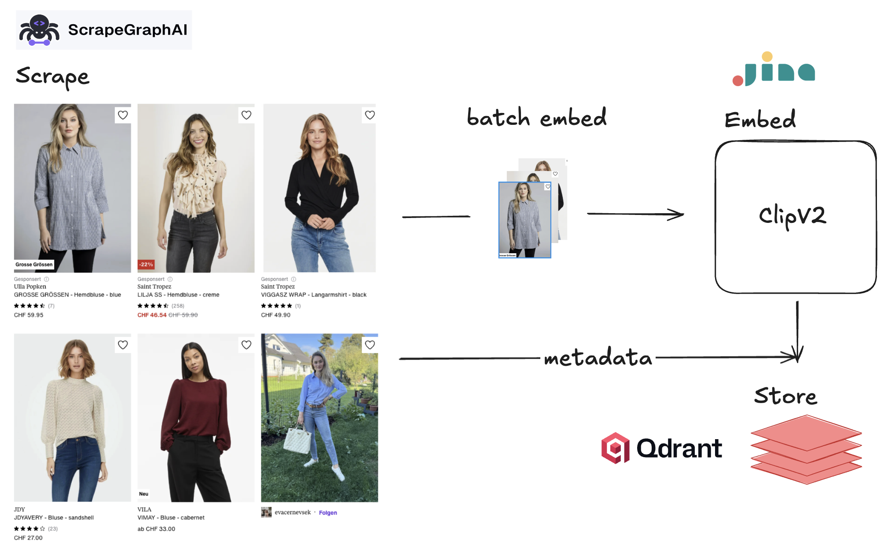

# Finding Clothes with Scrapegraph, Jina Clip v2 and Qdrant 👗

A multimodal search engine for fashion items from Zalando. This project demonstrates how to scrape product data, create embeddings from images and text, and build a vector search engine that allows you to find clothes using natural language queries or images.



## 🚀 Features

- **Smart Web Scraping**: Uses ScrapeGraph-AI to bypass website blockers and extract structured data
- **Multimodal Embeddings**: Leverages Jina CLIP v2 to create unified vector representations of images and text
- **Vector Search**: Stores and searches embeddings efficiently using Qdrant
- **Text and Image Queries**: Search for clothes using natural language descriptions or reference images
- **Quantization**: Optimized storage and performance with int8 quantization

## 📋 Prerequisites

- Python 3.13+
- Docker and Docker Compose (for running Qdrant)
- ScrapeGraph-AI API key (get one at [dashboard.scrapegraphai.com](https://dashboard.scrapegraphai.com/))

## 🛠️ Installation

### Using uv (recommended)

```bash
uv init
uv add python-dotenv scrapegraph-py==1.24.0 aiofiles sentence-transformers qdrant-client
```

### Using pip

```bash
pip install python-dotenv scrapegraph-py==1.24.0 aiofiles sentence-transformers qdrant-client
```

## ⚙️ Setup

1. **Create a `.env` file** with your ScrapeGraph-AI API key:

```env
SGAI_API_KEY="your_api_key_here"
```

2. **Start Qdrant** using Docker Compose:

```bash
docker compose up -d
```

This will start Qdrant on:
- API: `http://localhost:6333`
- Dashboard: `http://localhost:6333/dashboard`

## 📖 Usage

The project is organized as a Jupyter notebook (`Article.ipynb`) that walks through each step:

### 1. Scraping

Scrapes product data from Zalando including:
- Product name and brand
- Description and price
- Review scores
- Product and image URLs

The scraper processes multiple pages asynchronously and saves results to `scrape.jsonl`.

### 2. Embedding

Uses Jina CLIP v2 to create 512-dimensional vector embeddings from product images:

```python
from sentence_transformers import SentenceTransformer

model = SentenceTransformer(
    "jinaai/jina-clip-v2", 
    trust_remote_code=True, 
    truncate_dim=512
)

embeddings = model.encode(image_url, normalize_embeddings=True)
```

### 3. Storing

Inserts embeddings into Qdrant with:
- Cosine similarity metric
- INT8 scalar quantization for efficiency
- Original metadata stored as payload

### 4. Searching

Search using text queries:

```python
query = 'red pants'
query_embeddings = model.encode(query, normalize_embeddings=True)
results = client.search(
    collection_name="clothes",
    query_vector=query_embeddings.tolist(),
    limit=4
)
```

Or search using images:

```python
image_url = "https://example.com/shirt.jpg"
query_embeddings = model.encode(image_url, normalize_embeddings=True)
results = client.search(
    collection_name="clothes",
    query_vector=query_embeddings.tolist(),
    limit=4
)
```

## 📁 Project Structure

```
scrape-zalando/
├── Article.ipynb           # Main notebook with full implementation
├── docker-compose.yml      # Qdrant configuration
├── pyproject.toml         # Project dependencies
├── scrape.jsonl           # Scraped data
├── .env                   # API keys (not in repo)
├── images/                # Documentation images
│   ├── flow.png
│   └── ...
└── templates/             # HTML templates
    └── keep_html.tpl
```

## 🔍 How It Works

1. **Scraping**: ScrapeGraph-AI loads JavaScript-heavy pages, parses content, and uses LLMs to extract structured data matching your Pydantic schemas
2. **Embedding**: Jina CLIP v2 creates multimodal embeddings that represent both images and text in the same vector space
3. **Storage**: Qdrant stores embeddings with quantization for efficient similarity search
4. **Search**: Queries (text or images) are embedded and compared against stored vectors using cosine similarity

## 🎯 Configuration

Key parameters you can adjust:

```python
EMBEDDING_SIZE = 512        # Vector dimensions (64-1024)
BATCH_SIZE = 8              # Concurrent scraping requests
MAX_PAGES = 100             # Pages to scrape per category
QDRANT_URL = "http://localhost:6333"
```

## 🚧 Known Limitations

- Results may include mixed categories (e.g., red pants and red tops for "red pants" query) because product images often show full outfit contexts
- **Improvement idea**: Use image segmentation to isolate the actual product from the model before embedding

## 🔮 Future Enhancements

- Implement a re-ranker to improve result relevance
- Add image segmentation to focus on actual products
- Expand to more product categories
- Add filtering by price, brand, or review score
- Build a web interface for easy searching

## 📸 Screenshots

The Qdrant dashboard allows you to explore your collections and visualize embeddings:


## 🙏 Acknowledgments

- [ScrapeGraph-AI](https://scrapegraphai.com/) - Smart web scraping
- [Jina CLIP v2](https://jina.ai/news/jina-clip-v2-multilingual-multimodal-embeddings-for-text-and-images/) - Multimodal embeddings
- [Qdrant](https://qdrant.tech/) - Vector search engine

## 📝 License

This project is for educational purposes. Please respect Zalando's terms of service and robots.txt when scraping.

