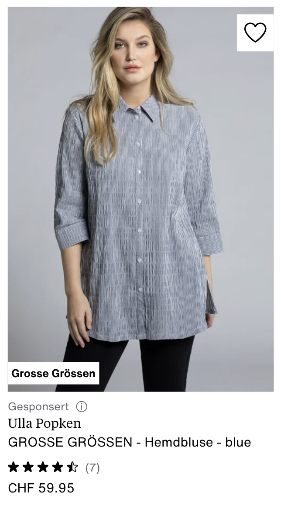

# Clothes multimodal search with Scrapegraph, Jina Clip v2 and Qdrant Vector DB 👗

Hi there 👋 Today we're build a small demo to search clothes from [zalando](https://zalando.com/),  directly with natural language or images. Our plan of attack is to first scrape them, embed the images using a multimodal model and then store them into a vector db so we can search!


Scraping websites is not an easy task, most of them cannot be easily fetch with an http request and requires javascript to be loaded. If we try to make a HTTP request to zalando, we'll be blocked.


```python
import requests

res = requests.get("https://www.zalando.it/jeans-donna")
# we'll get 403
res.status_code
```


    403


We need something smarter, [scrapegraph](https://scrapegraphai.com/) is a perfect tool for the job. It can bypass websites blockers and allow us to define a [pydantic schema](https://docs.pydantic.dev/latest/concepts/models/) to scrape the information we want. It works by loading the website, parsing it and use LLMs to fill our schema with the data within the page.

Once we get the data, we need a way to creates vector to store/search. Since we want to work with images and text, we need the heavy guns. [Jina ClipV2](https://jina.ai/news/jina-clip-v2-multilingual-multimodal-embeddings-for-text-and-images/) is a wonderful open source model that can represent as vector both images and text, thus is a perfect pick for the task.

Finally, we need to save our juicy vectors somewhere. [Qdrant](https://qdrant.tech/) is my go to vector database, you can self host it with [docker](https://hub.docker.com/r/qdrant/qdrant) and it comes with an handy ui. It supports different vector quantizations technics, so we can squeeze a lot of performances!

So, to recap. How plan of attack looks something like


1. Scrape with Scrapegraph
2. Embed with Jina ClipV2
3. Store with Qdrant

Let's get started!

## Setting it up

We'll need a bunch of packages. I am using `uv`, so we'll stick with it. You can init your project using

```
uv init
uv add python-dotenv scrapegraph-py==1.24.0 aiofiles sentence-transformers qdrant-client
```

Or if you prefer `pip`

```
pip install python-dotenv scrapegraph-py==1.24.0 aiofiles sentence-transformers qdrant-client
```


```python
!uv add python-dotenv scrapegraph-py==1.24.0 aiofiles sentence-transformers qdrant-client
```

    Resolved 158 packages in 0.43ms
    Audited 138 packages in 0.10ms


    huggingface/tokenizers: The current process just got forked, after parallelism has already been used. Disabling parallelism to avoid deadlocks...
    To disable this warning, you can either:
    	- Avoid using `tokenizers` before the fork if possible
    	- Explicitly set the environment variable TOKENIZERS_PARALLELISM=(true | false)


## Scraping

First thing all, head over [scrapegraph dashboard](https://dashboard.scrapegraphai.com/) and get your api key. Create a `.env` file and put it inside

```
GAI_API_KEY="YOUR_API_KEY"
```

Then we can load it


```python
from dotenv import load_dotenv
import os
load_dotenv()

SGAI_API_KEY = os.getenv("SGAI_API_KEY")
```

Now, we need to define the data we want. Each article/item in the website looks like:




We have a brand, name, description, price, image, review etc.

In order to tell scrapegraph what we want to extract, we have to define a couple of pydantic schemas. Since a page contains multiple items, we'll create an `ArticleModel`, so the single article, and `ArticlesModel` containing an array of them.

We can add `description` to make sure we guide the LLM into extracting the correct info


```python
from pydantic import BaseModel, Field
from typing import Optional
import asyncio


class ArticleModel(BaseModel):
    name: str = Field(description="Name of the article")
    brand: str = Field(description="Brand of the article")
    description: str = Field(description="Description of the article")
    price: float = Field(description="Price of the article")
    review_score: float = Field(description="Review score of the article, out of five.")
    url: str = Field(description="Article url")
    image_url: Optional[str]= Field(description="Article's image url")


class ArticlesModel(BaseModel):
    articles: list[ArticleModel] = Field(description="Articles on the page, only the ones with price, review and image. Discard the others")

```

Now, the fun part. We'll store our scraped data locally into a `.jsonl` file. We'll also add a `user_prompt` to guide even further scrapegraph. Since the scraping process is heavily I/O bound, we'll use their `AsyncClient` so we can fire a lot of them at once. 

Let's import everything and define our variables


```python
from time import perf_counter
# let' use async
from scrapegraph_py import AsyncClient
from scrapegraph_py.logger import sgai_logger
sgai_logger.set_logging(level="INFO")

# let's use async to write to the file as well
import aiofiles
import json
import asyncio
import os

JSON_PATH = "scrape.jsonl"
# how much scraping request to fire at one
BATCH_SIZE = 8
# how many pages per category
MAX_PAGES = 100

# the user prompt to send to scrapegraph along the pydantic schemas

user_prompt = """Extract ONLY the articles in the page with price, review and image url. Discard all the others."""
```

To start scraping, we can use the [smartscraper](https://docs.scrapegraphai.com/services/smartscraper) method. Let's quickly see it


```python
# defining our client
client = AsyncClient()
# get our zalando link for women's jeans - sorry I am Italian xD
url = "https://www.zalando.it/jeans-donna/"
# get the response
response = await client.smartscraper(
                website_url=url,
                user_prompt=user_prompt,
                output_schema=ArticlesModel)

response["result"]["articles"][0:2]
```

    💬 2025-09-22 21:35:01,268 🔑 Initializing AsyncClient
    💬 2025-09-22 21:35:01,268 ✅ AsyncClient initialized successfully
    💬 2025-09-22 21:35:01,269 🔍 Starting smartscraper request
    💬 2025-09-22 21:35:01,276 🚀 Making POST request to https://api.scrapegraphai.com/v1/smartscraper (Attempt 1/3)
    💬 2025-09-22 21:35:30,913 ✅ Request completed successfully: POST https://api.scrapegraphai.com/v1/smartscraper
    💬 2025-09-22 21:35:30,914 ✨ Smartscraper request completed successfully


    [{'name': 'Wrangler STRAIGHT - Jeans baggy - black',
      'brand': 'Wrangler',
      'description': 'No content available',
      'price': 79.95,
      'review_score': 0,
      'url': 'https://www.zalando.it/wrangler-jeans-a-sigaretta-black-wr121n019-q11.html',
      'image_url': 'https://img01.ztat.net/article/spp-media-p1/cfbd0384290c4d83a1aab8ad869e1d64/16cbb776a65e4f1eaa33a0e31ee8b66f.jpg?imwidth=300'},
     {'name': 'Stradivarius WITH POCKETS - Jeans a sigaretta - dark blue',
      'brand': 'Stradivarius',
      'description': 'No content available',
      'price': 39.99,
      'review_score': 0,
      'url': 'https://www.zalando.it/stradivarius-jeans-baggy-dark-blue-sth21n0k1-k11.html',
      'image_url': 'https://img01.ztat.net/article/spp-media-p1/2ec8568f05b249eab5dc984c9e93f0b3/9ad591321a5c49ac94a565c77781fa8b.jpg?imwidth=300'}]


Okay, let's make our code bulletproof. We need a function to save our data, to disk as jsonl


```python
async def save(result: dict):
    async with aiofiles.open(JSON_PATH, 'a') as f:
        await f.write(json.dumps(result) + '\n')
```

Let's then call `smartscraper`, passing the `client` and the `url`


```python
async def scrape_and_save(client: AsyncClient, url: str): 
    start = perf_counter()
    sgai_logger.info(f"Scraping url={url}")
    response = await client.smartscraper(
                website_url=url,
                user_prompt=user_prompt,
                output_schema=ArticlesModel)
    await save(response)
    sgai_logger.info(f"Tooked {perf_counter() - start:.2f}s")
```

Finally, putting all together. We'll scrape women's jeans and t-shirt tops. We'll check first if `JSON_PATH`, if so we'll assume we had scrape already


```python
async def main():
    get_urls = [
        lambda page: f"https://www.zalando.it/jeans-donna/?p={page}",
        lambda page: f"https://www.zalando.it/t-shirt-top-donna/?p={page}"
    ]

    should_scrape = not os.path.exists(JSON_PATH)
    if not should_scrape:
        sgai_logger.info(f"jsonl file exists, assuming we had scrape already. Quitting ...")
        return
    async with AsyncClient() as client:
        for get_url in get_urls:
            for i in range(1, MAX_PAGES + 1, BATCH_SIZE):
                pages = list(range(i, min(i + BATCH_SIZE, MAX_PAGES + 1)))
                tasks = [scrape_and_save(client, get_url(page)) for page in pages]
                await asyncio.gather(*tasks)

```


```python
# we'll take some minutes
await main()
```

    💬 2025-09-21 11:00:49,526 jsonl file exists, assuming we had scrape already. Quitting ...


And then you have it, each line is a page scraped!


```python
with open(JSON_PATH, "r") as f:
    for line in f.readlines():
        data = json.loads(line)
        break

data["result"]["articles"][0]
```


    {'name': 'PULL&BEAR BAGGY - Jeans baggy - white',
     'brand': 'PULL&BEAR',
     'description': 'Cropped top bianco senza maniche abbinato a pantaloni bianchi a gamba larga, con tasche frontali e chiusura a bottone. Sandali piatti marroni con borchie.',
     'price': 35.99,
     'review_score': 0,
     'url': 'https://www.zalando.it/pullandbear-jeans-bootcut-white-puc21n0rs-a11.html',
     'image_url': 'https://img01.ztat.net/article/spp-media-p1/ff33dd220e7c4827ba1b8be760e6de7c/b9ca1dcb64b04fa98b0e0d5fa38fff14.jpg?imwidth=300'}


## Embedding

The heavy part is done, now we need embed each image. Recall, our `pydantic` model has an `.image_url` field that hols the link the image for an article on zalando.


```python
data["result"]["articles"][0]["image_url"]
```


    'https://img01.ztat.net/article/spp-media-p1/ff33dd220e7c4827ba1b8be760e6de7c/b9ca1dcb64b04fa98b0e0d5fa38fff14.jpg?imwidth=300'


Let's do some good programming, limiting the amount of data we have in memory each time. We'll bach process the articles, thus we can load one line of the jsonl at the time. This can be done in python with a generator


```python
def get_articles_from_disk():
    with open(JSON_PATH, "r") as f:
        for line in f.readlines():
            data = json.loads(line)
            yield data["result"]["articles"]

articles_gen = get_articles_from_disk()
```

We'll use the wonderful [ClipV2 model made by Jina](https://jina.ai/news/jina-clip-v2-multilingual-multimodal-embeddings-for-text-and-images/) to create vectors for our images. The model has matryoshka representation; allowing (quoting from their blog post) to "truncate the output dimensions of both text and image embeddings from 1024 down to 64, reducing storage and processing overhead while maintaining strong performance.". We'll use 512 and use the model with [sentence_transformers](https://sbert.net/)


```python
from sentence_transformers import SentenceTransformer

EMBEDDING_SIZE = 512

# initialize the model - will take some time to download it
model = SentenceTransformer(
    "jinaai/jina-clip-v2", trust_remote_code=True, truncate_dim=EMBEDDING_SIZE
)
```

    `torch_dtype` is deprecated! Use `dtype` instead!
    `torch_dtype` is deprecated! Use `dtype` instead!
    /Users/francescozuppichini/.cache/huggingface/modules/transformers_modules/jinaai/jina-clip-implementation/39e6a55ae971b59bea6e44675d237c99762e7ee2/modeling_clip.py:137: UserWarning: Flash attention requires CUDA, disabling
      warnings.warn('Flash attention requires CUDA, disabling')
    /Users/francescozuppichini/.cache/huggingface/modules/transformers_modules/jinaai/jina-clip-implementation/39e6a55ae971b59bea6e44675d237c99762e7ee2/modeling_clip.py:172: UserWarning: xFormers requires CUDA, disabling
      warnings.warn('xFormers requires CUDA, disabling')
    Using a slow image processor as `use_fast` is unset and a slow processor was saved with this model. `use_fast=True` will be the default behavior in v4.52, even if the model was saved with a slow processor. This will result in minor differences in outputs. You'll still be able to use a slow processor with `use_fast=False`.


Then, we can just pass an image url to get the embeddings, we also normalize them since we will use cosine to perform search later


```python
image_embeddings = model.encode(data["result"]["articles"][0]["image_url"], normalize_embeddings=True)

image_embeddings[0:10]
```


    array([-0.12898703,  0.13965721, -0.13102548,  0.09683744, -0.02695999,
            0.04831071, -0.15391393,  0.01224686, -0.10350402,  0.05697947],
          dtype=float32)


## Storing

Now we need somewhere to store them. Qdrant is a perfect solution, we'll run it locally with [docker](https://docs.docker.com/engine/install/) and [docker compose](https://docs.docker.com/compose/).

Assuming you have it on your system; we create a `docker-compose.yml` file

```yml
version: "3.8"

services:
  qdrant:
    image: qdrant/qdrant:latest
    ports:
      - "6333:6333"
      - "6334:6334"
    volumes:
      - ./qdrant_storage:/qdrant/storage:z

```

Then, simply

```bash
docker compose up -d
```

This will spin up qdrant, it also comes with a very nice ui accessible at `http://localhost:6333/dashboard#/collections` in which you can see your data.

### Initialize the database

We need to create a collection, we'll also use quantization to speed up things and save storage. You can read more on [qdrant doc](https://qdrant.tech/documentation/guides/quantization/) and `cosine` similarity to search. Also, we will keep the quantized vector in ram, speeding up things as well.


```python
from qdrant_client import QdrantClient, models
import numpy as np

QDRANT_COLLECTION_NAME = "clothes"
QDRANT_URL = "http://localhost:6333"

# defining qdrant client
client = QdrantClient(url=QDRANT_URL)

# checking if we haven't created the collection already
if not client.collection_exists(QDRANT_COLLECTION_NAME):
    print(f"{QDRANT_COLLECTION_NAME} created!")
    client.create_collection(
        collection_name=QDRANT_COLLECTION_NAME,
        vectors_config=models.VectorParams(
            size=EMBEDDING_SIZE, distance=models.Distance.COSINE, on_disk=True
        ),
        quantization_config=models.ScalarQuantization(
            scalar=models.ScalarQuantizationConfig(
                type=models.ScalarType.INT8,
                quantile=0.99,
                always_ram=True,
            ),
        ),
    )
```

    Unclosed client session
    client_session: <aiohttp.client.ClientSession object at 0x10726f230>


We want to process our data in batches, to take advantage of the model and the network with qdrant.


```python
import uuid
from tqdm.autonotebook import tqdm

BATCH_SIZE = 8


def embed_articles(data: dict) -> np.array:
    image_urls = [el["image_url"] for el in batch]
    image_embeddings = model.encode(
            image_urls, normalize_embeddings=True
        )
    return image_embeddings       
```

### Inserting in the database

Then, we can create a function to insert them into the db. We'll also store the dictionary itself, we can pass it to the `payload` method.


```python
def insert_articles_in_db(batch: list[dict], embeddings: np.array):
    client.upsert(
        collection_name=QDRANT_COLLECTION_NAME,
        points=[
            models.PointStruct(
                id=str(uuid.uuid4()),
                vector=vector,
                payload=payload
            )
            for payload, vector in zip(batch, embeddings)
        ],
    )
```

Putting it all together, we'll check if the have points in the collection; if so we'll assume we run it already


```python
def store_to_vector_db():
    shold_insert = client.count(QDRANT_COLLECTION_NAME).count == 0
    if not shold_insert: 
        print(f"Collection={QDRANT_COLLECTION_NAME} not empty. Exiting ...")
        return
    with tqdm(articles_gen, desc="Article Collections", position=0) as pbar_collections:
        for articles in pbar_collections:
            batches = list(range(0, len(articles), BATCH_SIZE))
            with tqdm(batches, desc="Processing Batches", position=1, leave=False) as pbar_batches:
                for i in pbar_batches:
                    batch = articles[i:i + BATCH_SIZE]
                    embeddings = embed_articles(batch)
                    insert_articles_in_db(batch, embeddings)

store_to_vector_db()
```

    Collection=clothes not empty. Exiting ...


We can head over the [qdrant ui](http://localhost:6333/dashboard#/collections/clothes) to see our data


It also comes with a very cool dimension reduction tab; to explore our data even further!


### Searching

We can now search 🥳! With either a text query or an image


```python
query = 't-shirt black'
# call the model to embed the query
query_embeddings = model.encode(
    query, prompt_name='retrieval.query', normalize_embeddings=True
    
)  
# getting results
res = client.search(
        collection_name=QDRANT_COLLECTION_NAME,
        query_vector=query_embeddings.tolist(),
        limit=4,
    )

res
```

    /var/folders/_t/kq5v2mjs6c90llk5bdqhgndc0000gn/T/ipykernel_6181/2776768032.py:8: DeprecationWarning: `search` method is deprecated and will be removed in the future. Use `query_points` instead.
      res = client.search(


    [ScoredPoint(id='ab1f69a0-4fd0-4bce-b2ef-d01f708fc786', version=8, score=0.3037891, payload={'name': 'LeePERFECT TEE - T-shirt basic - unionall black', 'brand': 'Lee', 'description': 'T-shirt nera in cotone a maniche corte, con scollatura a girocollo e una vestibilità leggermente ampia, abbinata a jeans azzurri chiari con spacchi laterali.', 'price': 29.95, 'review_score': 0, 'url': 'https://www.zalando.it/lee-perfect-t-shirt-basic-unionall-black-le421d08n-q11.html', 'image_url': 'https://img01.ztat.net/article/spp-media-p1/51e721ff461a4bf5af1ea9817f8c2b58/19645bcfdfec4d8bac250cea5a4a051b.jpg?imwidth=300'}, vector=None, shard_key=None, order_value=None),
     ScoredPoint(id='93230ebc-05d2-430a-a5bf-13df6279f2b9', version=17, score=0.25808161, payload={'name': 'Calliope Jeans a sigaretta', 'brand': 'Calliope', 'description': '', 'price': 35.99, 'review_score': 0, 'url': 'https://www.zalando.it/calliope-jeans-a-sigaretta-nero-denim-csm21n062-q11.html', 'image_url': 'https://img01.ztat.net/article/spp-media-p1/ae1d7db5039c43b3b1aedfdbe72c5fc0/2d07663124c14a6b8c842503f3468235.jpg?imwidth=300'}, vector=None, shard_key=None, order_value=None),
     ScoredPoint(id='b779405a-6e45-4ac6-a2b1-65c9f338c9f0', version=4, score=0.24658957, payload={'name': 'Tommy Jeans MOM - Jeans mom fit - denim black', 'brand': 'Tommy Jeans', 'description': 'T-shirt bianca in cotone con logo rosso "tommy jeans", abbinata a pantaloni neri e una giacca di pelle nera. Sneakers bianche completano il look.', 'price': 64.99, 'review_score': 0, 'url': 'https://www.zalando.it/tommy-jeans-mom-jeans-baggy-denim-black-tob21n0tq-q11.html', 'image_url': 'https://img01.ztat.net/article/spp-media-p1/91c74d136e8d470cbebf8f9d6afb7b5b/db59f4efc20347919e0e1a2148aeb986.jpg?imwidth=300'}, vector=None, shard_key=None, order_value=None),
     ScoredPoint(id='e66cab2d-e0fa-4ea1-91e5-e69e6b4b7586', version=10, score=0.24387194, payload={'name': 'Stradivarius WITH RHINESTONES - Jeans baggy - mottled light grey', 'brand': 'Stradivarius', 'description': 'No content available', 'price': 49.99, 'review_score': 0, 'url': 'https://www.zalando.it/stradivarius-jeans-a-sigaretta-mottled-light-grey-sth21n0om-c11.html', 'image_url': 'https://img01.ztat.net/article/spp-media-p1/249d670066a34cbf9f2d6e3d5a782cf2/8b8e300ac87747c7b92aac6d81ff7a96.jpg?imwidth=300'}, vector=None, shard_key=None, order_value=None)]


Let's define a function to show the results


```python
from IPython.display import display, HTML

def show_images(res):
    html = "<div style='display:grid;grid-template-columns:repeat(4,1fr);gap:10px;'>"
    for result in res:
        html += f""
    html += "</div>"
    display(HTML(html))

show_images(res)
```


<div style='display:grid;grid-template-columns:repeat(4,1fr);gap:10px;'></div>


```python
# or using either a pil image or a url
from IPython.display import Image, display
image_url = "https://d1fufvy4xao6k9.cloudfront.net/images/landings/43/shirts-mob-1.jpg"
# call the model to embed the query
query_embeddings = model.encode(
            image_url, normalize_embeddings=True
        )
# getting results
res = client.search(
        collection_name=QDRANT_COLLECTION_NAME,
        query_vector=query_embeddings.tolist(),
        limit=4,
    )

Image(url=image_url, width=400)
```

    /var/folders/_t/kq5v2mjs6c90llk5bdqhgndc0000gn/T/ipykernel_6181/1374654977.py:9: DeprecationWarning: `search` method is deprecated and will be removed in the future. Use `query_points` instead.
      res = client.search(


```python
show_images(res)
```


<div style='display:grid;grid-template-columns:repeat(4,1fr);gap:10px;'></div>


## Conclusion

So we show how to scrape, embed and search using both text and images items from zalando. We could expand it further by actually scraping more data and implement a re-ranker to show up results that are really relevant to the query - but I'll leave it to you here :)


```python

```


```python

```


```python

```
